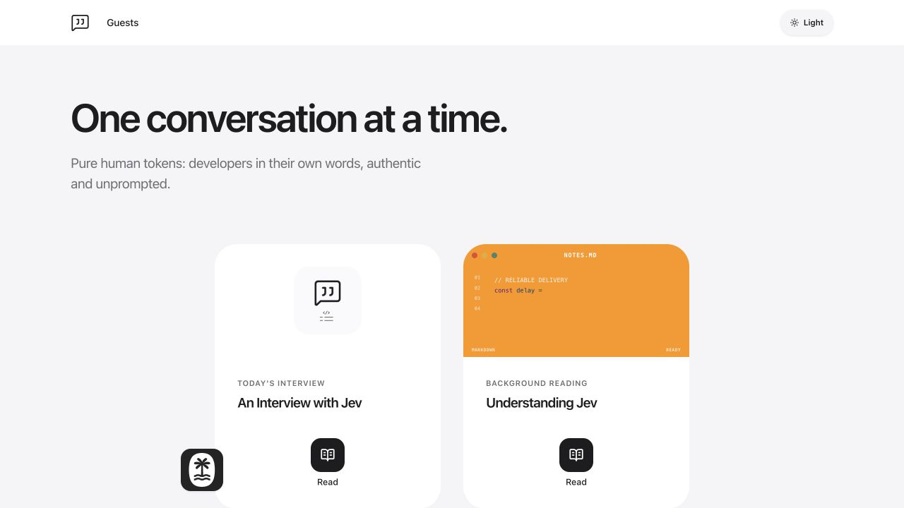
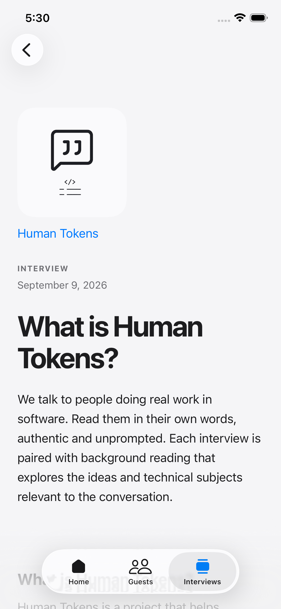
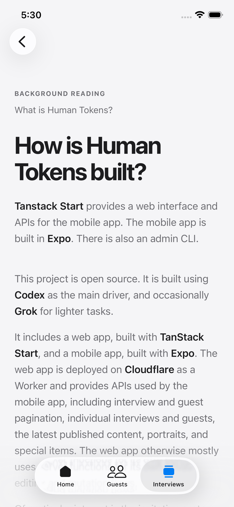

# Human Tokens

Human Tokens is a collection of apps for publishing and reading interviews.
Each app manages its own Bun dependencies and lockfile; the repository root is not a Bun workspace.

Read [how the site is built](https://tnspacetime.com/posts/human-tokens).

| Directory | Purpose |
| --- | --- |
| `apps/software-web` | Software interview website, public API, and protected curation API |
| `apps/curation-cli` | Interactive client for the protected curation API |
| `apps/software-mobile` | Mobile interview reader |
| `apps/web` | Separate web app |

Start with the README in the app you want to run. Local credentials belong in `.env.local` and are excluded from Git. The example environment files contain placeholders only.

## Endpoint structure

[`apps/software-web`](apps/software-web) serves these routes at [software.human-tokens.dev](https://software.human-tokens.dev). The web editors also use TanStack Start server functions; those internal calls are not separate named API routes. Parameters are shown with a leading `:`.

### Website pages

| Method and path | Purpose |
| --- | --- |
| `GET /` | Show the latest published interview and background reading. |
| `GET /guests` | Browse the guest directory. |
| `GET /i/:publicId` | Read a published interview and its background reading. |
| `GET /contribute/:linkId` | Open a guest workspace through a private invitation. |
| `GET /contribute` | Show the unavailable invitation page. |
| `GET /draft/:token` | Redeem a private authoring token and redirect to the draft editor. |
| `GET /draft/:linkId` | Open the draft editor with its link-specific cookie. |
| `GET /draft` | Show the unavailable draft link page. |
| `GET /share/:shareId` | Read a fixed share snapshot. |
| `GET /share/:shareId/portrait` | Load the portrait attached to a share snapshot. |
| `GET /site.webmanifest` | Serve the web app manifest. |

The token and link ID forms of `/draft/:value` are handled by the same route; the value's format determines which flow runs.

### Public API

| Method and path | Purpose |
| --- | --- |
| `GET /api/v1/latest` | Get the latest published interview and background-reading pair. |
| `GET /api/v1/interviews` | List published interviews with pagination. |
| `GET /api/v1/interviews/:publicId` | Get one published pair. |
| `GET /api/v1/interviews/:publicId/portrait` | Get an interview portrait. |
| `GET /api/v1/guests` | List guests with pagination. |
| `GET /api/v1/guests/:guestId` | Get one guest. |
| `GET /api/v1/extras` | Get announcements and special items. |

### Contribution API

These routes require the cookie established by a private guest invitation. Guest answers are saved through a TanStack Start server function.

| Method and path | Purpose |
| --- | --- |
| `GET /api/v1/contribution/:linkId/portrait-image` | Get the guest's uploaded photo. |
| `PUT /api/v1/contribution/:linkId/portrait-image` | Upload or replace the guest photo. |
| `GET /api/v1/contribution/:linkId/transcribe` | Upgrade to a WebSocket for live transcription. |

### Admin API

These routes require the curation bearer token used by [`apps/curation-cli`](apps/curation-cli).

| Method and path | Purpose |
| --- | --- |
| `POST /api/v1/admin/drafts` | Create an interview or background-reading draft. |
| `GET /api/v1/admin/guests` | Search or list guests. |
| `POST /api/v1/admin/guests` | Create a guest. |
| `GET /api/v1/admin/interviews` | Search or list interviews. |
| `GET /api/v1/admin/interviews/:interviewId` | Get an interview by its internal UUID. |
| `PUT /api/v1/admin/interviews/:interviewId/guest` | Attach a guest to an interview. |
| `POST /api/v1/admin/publish` | Publish an interview with its background reading. |
| `POST /api/v1/admin/share-snapshots` | Create a fixed share link. |
| `DELETE /api/v1/admin/share-snapshots/:snapshotId` | Revoke a share link. |

## Screenshots

### Software website

### Mobile app

| Interview | Background reading |
| :---: | :---: |
|  |  |

## License

MIT. See [LICENSE](LICENSE).
